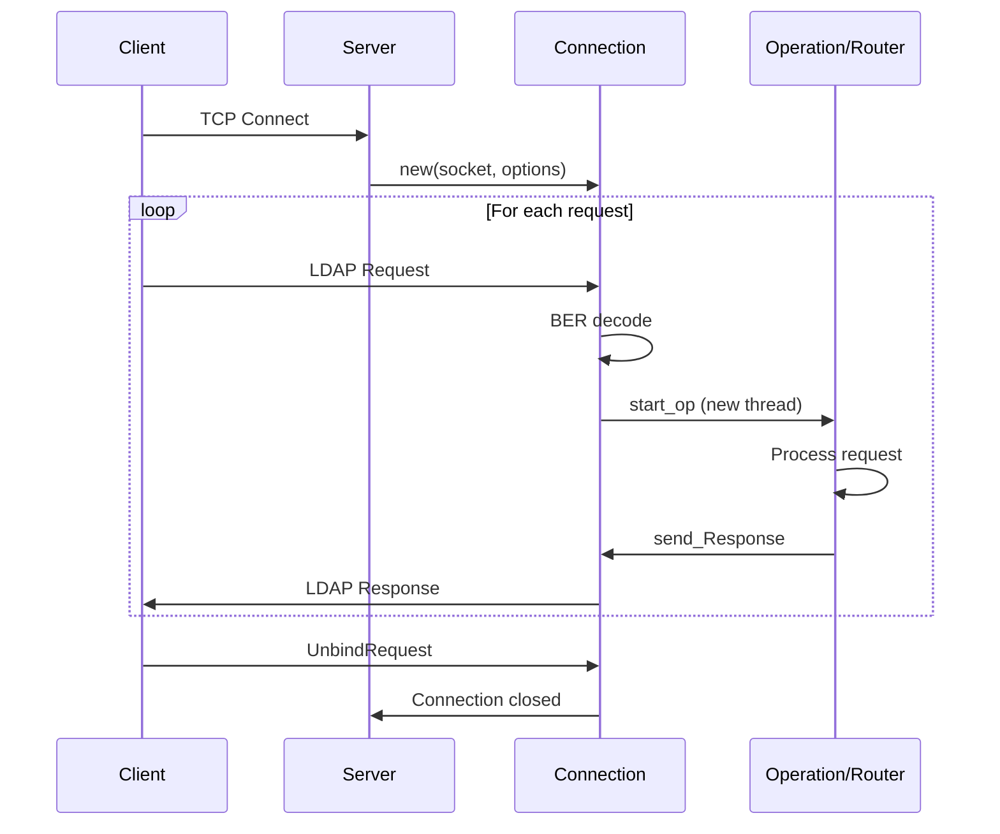

## Overview

ruby-ldapserver is built around four main components that work together to handle LDAP protocol communications:

- **Server**: Main entry point that manages network connections
- **Connection**: Handles individual client sessions and request/response multiplexing
- **Operation**: Processes individual LDAP requests (legacy approach)
- **Router**: Modern request routing system for mapping DNs to controller actions

## Component Hierarchy

```
LDAP::Server
    |
    +-- manages --> LDAP::Server::Connection (one per client)
                         |
                         +-- creates --> LDAP::Server::Operation (one per request)
                         |               OR
                         +-- uses -----> LDAP::Server::Router
```

## Server Component

The `LDAP::Server` class is the main entry point for your LDAP server application. It:

- Configures listening sockets (TCP or UNIX domain)
- Manages SSL/TLS settings
- Creates Connection objects for incoming clients
- Stores server-wide configuration like schema and root DSE

See `lib/ldap/server/server.rb:7`

### Creating a Server

```ruby
server = LDAP::Server.new(
  port: 1389,
  bindaddr: '127.0.0.1',
  nodelay: true,
  operation_class: MyOperation,  # Legacy approach
  # OR
  router: MyRouter,              # Modern approach
  schema: my_schema,
  namingContexts: ['dc=example,dc=com']
)

server.run_tcpserver
server.join
```

### Server Options

<ParamField path="port" type="integer" default="389">
  Port number to listen on
</ParamField>

<ParamField path="bindaddr" type="string" default="0.0.0.0">
  IP address to bind to (cannot be combined with socket)
</ParamField>

<ParamField path="socket" type="string">
  UNIX domain socket path (cannot be combined with bindaddr/port)
</ParamField>

<ParamField path="nodelay" type="boolean" default="true">
  Enable TCP_NODELAY option for lower latency
</ParamField>

<ParamField path="operation_class" type="Class">
  Legacy: Class to handle operations (subclass of LDAP::Server::Operation)
</ParamField>

<ParamField path="router" type="Router">
  Modern: Router instance for request routing (overrides operation_class)
</ParamField>

## Connection Component

The `LDAP::Server::Connection` class handles communication with a single LDAP client. Each client connection runs in its own Ruby thread.

See `lib/ldap/server/connection.rb:15`

### Key Responsibilities

1. **ASN.1 Decoding**: Reads and decodes BER-encoded LDAP messages
2. **Request Multiplexing**: LDAP allows multiple concurrent requests on one connection
3. **Thread Management**: Spawns a new thread for each operation to handle async requests
4. **Response Synchronization**: Uses mutex to ensure responses don't interfere with each other
5. **Bind State**: Tracks the authenticated DN and LDAP protocol version

### Threading Model

From `lib/ldap/server/connection.rb:177`:

```ruby
def start_op(messageId, protocolOp, controls, meth)
  operationClass = @opt[:operation_class]
  ocArgs = @opt[:operation_args] || []
  thr = Thread.new do
    begin
      if @opt[:router]
        @opt[:router].send meth, self, messageId, protocolOp, controls
      else
        operationClass.new(self, messageId, *ocArgs).
        send(meth, protocolOp, controls)
      end
    rescue Exception => e
      log_exception e
    end
  end
  thr[:messageId] = messageId
  @threadgroup.add(thr)
end
```

Each operation runs in its own thread, allowing the client to send multiple requests without waiting for responses in order.

<Warning>
If your operation handlers access shared data, you must use proper thread synchronization (Mutex, etc.) to avoid race conditions.
</Warning>

## Operation vs Router

ruby-ldapserver supports two patterns for handling LDAP requests:

### Legacy: Operation Class Pattern

Subclass `LDAP::Server::Operation` and override methods:

```ruby
class MyOperation < LDAP::Server::Operation
  def initialize(connection, messageID, *args)
    super(connection, messageID)
    # Custom initialization
  end

  def simple_bind(version, dn, password)
    # Authenticate the user
  end

  def search(basedn, scope, deref, filter)
    # Process search request
  end
end

server = LDAP::Server.new(
  operation_class: MyOperation,
  operation_args: ['custom', 'args']
)
```

### Modern: Router Pattern

Map DNs to controller actions using the Router:

```ruby
router = LDAP::Server::Router.new(logger) do
  bind nil => "AuthController#bind"
  search "ou=Users,dc=example,dc=com" => "UserController#search"
  search "ou=Groups,dc=example,dc=com" => "GroupController#search"
end

server = LDAP::Server.new(router: router)
```

The router pattern provides:
- Cleaner separation of concerns
- Parameterized DN routing (e.g., `uid=:username,ou=Users`)
- More maintainable code for complex servers

## Data Flow



## Root DSE

The Server automatically provides a Root DSE (Directory Server Entry) at basedn="" with scope=baseObject:

From `lib/ldap/server/server.rb:50`:

```ruby
@root_dse = Hash.new { |h,k| h[k] = [] }.merge({
  'objectClass' => ['top','openLDAProotDSE','extensibleObject'],
  'supportedLDAPVersion' => ['3'],
})
@root_dse['subschemaSubentry'] = [@schema.subschema_dn] if @schema
@root_dse['namingContexts'] = opt[:namingContexts] if opt[:namingContexts]
```

Clients can query the root DSE to discover server capabilities.

## SSL/TLS Support

The Server supports SSL/TLS connections:

```ruby
LDAP::Server.new(
  ssl_key_file: 'key.pem',
  ssl_cert_file: 'cert.pem',
  ssl_on_connect: true,  # SSL from start (ldaps://)
  ssl_ca_path: '/etc/ssl/certs',  # For client cert verification
)
```

See `lib/ldap/server/server.rb:64` for SSL context initialization.

## Next Steps

<CardGroup cols={2}>
  <Card title="Operation Class" icon="code" href="/concepts/operations">
    Learn about the Operation class pattern
  </Card>
  <Card title="Router" icon="route" href="/concepts/router">
    Explore the modern Router approach
  </Card>
  <Card title="Connection Handling" icon="network-wired" href="/concepts/connection-handling">
    Deep dive into connection management
  </Card>
</CardGroup>