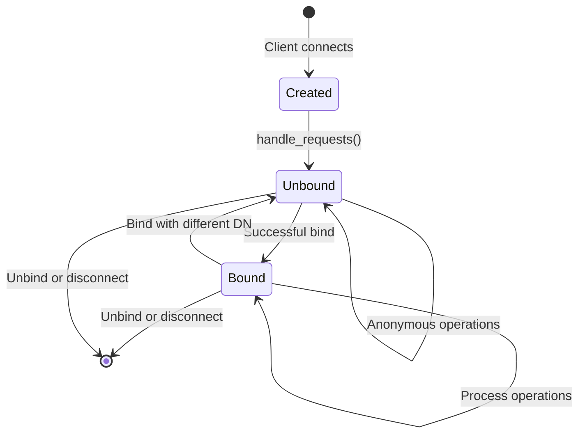

## Overview

The `LDAP::Server::Connection` class manages communication with individual LDAP clients. Understanding its threading model and lifecycle is crucial for building robust LDAP servers.

See `lib/ldap/server/connection.rb:15`

## Connection Lifecycle



### 1. Creation

When a client connects, the server creates a new Connection:

From `lib/ldap/server/server.rb:92`:

```ruby
LDAP::Server.tcpserver(@opt) do
  LDAP::Server::Connection::new(self, opt).handle_requests
end
```

From `lib/ldap/server/connection.rb:18`:

```ruby
def initialize(io, opt={})
  @io = io                      # TCP socket
  @opt = opt                    # Server configuration
  @mutex = Mutex.new            # Response synchronization
  @threadgroup = ThreadGroup.new  # Track operation threads
  @binddn = nil                 # Currently authenticated DN
  @version = 3                  # LDAP protocol version
  @logger = @opt[:logger]
  @ssl = false
  
  startssl if @opt[:ssl_on_connect]
end
```

### 2. Request Handling Loop

The connection enters an infinite loop reading and dispatching requests:

From `lib/ldap/server/connection.rb:95`:

```ruby
def handle_requests
  catch(:close) do
    while true
      begin
        blk = ber_read(@io)  # Read ASN.1 encoded request
        asn1 = OpenSSL::ASN1::decode(blk)
        
        # Extract message ID and operation type
        messageId = asn1.value[0].value
        protocolOp = asn1.value[1]
        
        case protocolOp.tag
        when 0  # BindRequest
          abandon_all
          # Handle bind...
        when 2  # UnbindRequest
          throw(:close)
        when 3  # SearchRequest
          start_op(messageId, protocolOp, controls, :do_search)
        when 6  # ModifyRequest
          start_op(messageId, protocolOp, controls, :do_modify)
        # ... other operations
        end
      rescue LDAP::ResultError::ProtocolError => e
        send_notice_of_disconnection(e.to_i, e.message)
        throw(:close)
      end
    end
  end
  abandon_all
end
```

### 3. Connection Termination

Connections close when:
- Client sends UnbindRequest
- Protocol error occurs
- Network connection drops
- Server shuts down

## Threading Model

<Info>
From the README: "Because the LDAP protocol allows a client to send multiple overlapping requests down the same TCP connection, I start a new Ruby thread for each Operation."
</Info>

### One Thread Per Operation

Each LDAP request (except bind) runs in its own thread:

From `lib/ldap/server/connection.rb:177`:

```ruby
def start_op(messageId, protocolOp, controls, meth)
  operationClass = @opt[:operation_class]
  ocArgs = @opt[:operation_args] || []
  
  thr = Thread.new do
    begin
      if @opt[:router]
        @opt[:router].send meth, self, messageId, protocolOp, controls
      else
        operationClass.new(self, messageId, *ocArgs).
        send(meth, protocolOp, controls)
      end
    rescue Exception => e
      log_exception e
    end
  end
  
  thr[:messageId] = messageId
  @threadgroup.add(thr)
end
```

**Why separate threads?**

1. **Asynchronous Processing**: Client can send request 2 before request 1 completes
2. **Concurrent Operations**: Multiple searches can execute simultaneously
3. **Long-Running Queries**: One slow operation doesn't block others

### Thread Management with ThreadGroup

All operation threads are tracked in a ThreadGroup:

```ruby
@threadgroup = ThreadGroup.new
# ...
@threadgroup.add(thr)  # Add operation thread
```

This enables:
- Abandoning specific operations by messageId
- Abandoning all operations on new bind or disconnect

### Response Synchronization

Multiple threads might try to send responses simultaneously. A mutex prevents interleaving:

From `lib/ldap/server/connection.rb:196`:

```ruby
def write(data)
  @mutex.synchronize do
    @io.write(data)
    @io.flush
  end
end

def writelock
  @mutex.synchronize do
    yield @io
    @io.flush
  end
end
```

**Example:**

```
Thread 1: send_SearchResultEntry(...)  ┐
Thread 2: send_SearchResultEntry(...)  ├─ @mutex ensures these
Thread 1: send_SearchResultEntry(...)  │  don't interleave
Thread 2: send_SearchResultDone(0)     ┘
```

## Bind Request Handling

Bind requests are special - they don't run in separate threads and abandon all existing operations:

From `lib/ldap/server/connection.rb:119`:

```ruby
when 0 # BindRequest
  abandon_all  # Cancel all pending operations!
  if @opt[:router]
    @binddn, @version = @opt[:router].do_bind(self, messageId, protocolOp, controls)
  else
    operationClass = @opt[:operation_class]
    ocArgs = @opt[:operation_args] || []
    @binddn, @version = operationClass.new(self, messageId, *ocArgs).
                        do_bind(protocolOp, controls)
  end
```

**Why abandon_all?**

From RFC 2251: Binding changes the authentication state, so any pending operations may have been started under different credentials.

## Abandon Handling

Clients can send AbandonRequest to cancel a pending operation.

From `lib/ldap/server/connection.rb:210`:

```ruby
def abandon(messageID)
  @mutex.synchronize do
    thread = @threadgroup.list.find { |t| t[:messageId] == messageID }
    thread.raise LDAP::Abandon if thread
  end
end

def abandon_all
  @mutex.synchronize do
    @threadgroup.list.each do |thread|
      thread.raise LDAP::Abandon
    end
  end
end
```

When a thread is abandoned, `LDAP::Abandon` exception is raised inside it.

### Handling Abandon in Operations

From README.md line 116:

<Warning>
If you rescue Abandon exceptions and put resources back into a pool (e.g., database connections), ensure those resources aren't mid-operation. Better to discard and use fresh ones.
</Warning>

```ruby
def search(basedn, scope, deref, filter)
  begin
    results = @database.execute_query(basedn, filter)
    results.each do |entry|
      send_SearchResultEntry(entry.dn, entry.attributes)
    end
  rescue LDAP::Abandon
    # Request was abandoned
    @database.cancel_current_query
    # DO NOT send a response - client expects none
    # DO NOT put @database back in pool - it may be mid-query
  ensure
    # Clean up resources
  end
end
```

## Timeout Handling

Time limits cause `LDAP::ResultError::TimeLimitExceeded` to be raised in the operation thread.

From `lib/ldap/server/operation.rb:310` (similar in Router):

```ruby
t = server_timelimit || 10
t = client_timelimit if client_timelimit > 0 and client_timelimit < t

Timeout::timeout(t, LDAP::ResultError::TimeLimitExceeded) do
  search(baseObject, scope, deref, filter)
end
send_SearchResultDone(0)

rescue LDAP::ResultError => e
  send_SearchResultDone(e.to_i, :errorMessage=>e.message)
```

### Setting Time Limits

```ruby
class MyOperation < LDAP::Server::Operation
  def server_timelimit
    # Override to set server-side limit
    30  # 30 seconds
  end
end
```

The effective limit is the minimum of:
1. Server-configured limit (`server_timelimit`)
2. Client-requested limit (from SearchRequest)
3. Default (10 seconds if not specified)

## SSL/TLS Connections

### SSL on Connect

From `lib/ldap/server/connection.rb:28`:

```ruby
def initialize(io, opt={})
  # ...
  startssl if @opt[:ssl_on_connect]
end
```

Configuration:

```ruby
server = LDAP::Server.new(
  port: 636,  # Standard ldaps:// port
  ssl_key_file: 'server-key.pem',
  ssl_cert_file: 'server-cert.pem',
  ssl_on_connect: true
)
```

### StartTLS Support

The `startssl` method wraps the existing connection in SSL:

From `lib/ldap/server/connection.rb:43`:

```ruby
def startssl
  @mutex.synchronize do
    raise LDAP::ResultError::OperationsError if @ssl or @threadgroup.list.size > 0
    yield if block_given?
    @io = OpenSSL::SSL::SSLSocket.new(@io, @opt[:ssl_ctx])
    @io.sync_close = true
    @io.accept
    @ssl = true
  end
end
```

<Note>
StartTLS is only permitted when no operations are pending (`@threadgroup.list.size > 0`).
</Note>

## BER Reading

LDAP uses BER (Basic Encoding Rules) encoding. The connection reads BER efficiently:

From `lib/ldap/server/connection.rb:57`:

```ruby
def ber_read(io)
  blk = io.read(2)  # Minimum: short tag, short length
  throw(:close) if blk.nil?
  
  codepoints = blk.respond_to?(:codepoints) ? blk.codepoints.to_a : blk
  
  tag = codepoints[0] & 0x1f
  len = codepoints[1]
  
  # Handle long-form tag
  if tag == 0x1f
    # ...
  end
  
  # Handle long-form length
  if (len & 0x80) != 0
    # ...
  end
  
  # Read the value
  blk << io.read(len)
  return blk
end
```

This incremental reading allows handling arbitrarily large LDAP messages efficiently.

## Connection State

The connection tracks several pieces of state:

### Bind DN and Version

```ruby
attr_reader :binddn, :version, :opt

# Access in operations:
def search(basedn, scope, deref, filter)
  current_user = @connection.binddn  # nil if anonymous
  ldap_version = @connection.version  # Usually 3
end
```

### Logging

From `lib/ldap/server/connection.rb:31`:

```ruby
def log(msg, severity = Logger::INFO)
  @logger.add(severity, msg, @io.peeraddr[3])
end

def debug(msg)
  log msg, Logger::DEBUG
end

def log_exception(e)
  log "#{e}: #{e.backtrace.join("\n\tfrom ")}", Logger::ERROR
end
```

Log messages include the client's IP address from `@io.peeraddr[3]`.

## Thread Safety Considerations

<Warning>
From README.md line 91: "If your Operation object deals with any global shared data, then it needs to do so in a thread-safe way."
</Warning>

### Safe Patterns

✅ **Use Mutex for shared state:**

```ruby
class MyOperation < LDAP::Server::Operation
  @@user_cache = {}
  @@cache_mutex = Mutex.new
  
  def search(basedn, scope, deref, filter)
    @@cache_mutex.synchronize do
      # Safe cache access
      if cached = @@user_cache[basedn]
        return send_SearchResultEntry(basedn, cached)
      end
    end
    
    # Fetch from source...
  end
end
```

✅ **Use thread-safe libraries:**

From README.md line 106:

> "For example, when talking to a MySQL database, you might want to choose `ruby-mysql` (which is a pure Ruby implementation of the MySQL protocol) rather than `mysql-ruby` (which is a wrapper around the C API, and blocks while waiting for responses from the server)"

✅ **Use connection pools:**

```ruby
class MyOperation < LDAP::Server::Operation
  def initialize(connection, messageID, db_pool)
    super(connection, messageID)
    @db_pool = db_pool
  end
  
  def search(basedn, scope, deref, filter)
    @db_pool.with_connection do |db|
      results = db.execute("SELECT ...")
      # ...
    end
  end
end
```

### Unsafe Patterns

❌ **Unprotected shared state:**

```ruby
class MyOperation < LDAP::Server::Operation
  @@counter = 0  # RACE CONDITION!
  
  def search(basedn, scope, deref, filter)
    @@counter += 1  # Multiple threads will corrupt this
  end
end
```

❌ **Blocking C libraries:**

From README.md line 104:

> "The client library `ruby-ldap` blocks when waiting for a response from a remote server, since it's a wrapper around a C library which is unaware of Ruby's threading engine. This can cause your application to 'freeze' periodically."

## Performance Considerations

### TCP Server vs Preforking

The default `run_tcpserver` uses Ruby threads:

```ruby
server.run_tcpserver  # One Ruby process, threaded
server.join
```

For multi-CPU systems or very high load, use preforking:

```ruby
server.run_prefork  # Multiple processes
server.join
```

From README.md line 100:

> "With a very large number of concurrent client connections, you may find you hit the max-filedescriptors-per-process limit."

### Benchmark Results

From README.md line 122:

> Using speedtest.rb and rbslapd1.rb, running on the same machine (single-processor AMD Athlon 2500+) I achieve around 800 searches per second with N=1,M=1000 and 300-400 searches per second with N=10,M=100.

## Unsolicited Notifications

The server can send unsolicited notifications (e.g., "Notice of Disconnection"):

From `lib/ldap/server/connection.rb:225`:

```ruby
def send_unsolicited_notification(resultCode, opt={})
  protocolOp = [
    OpenSSL::ASN1::Enumerated(resultCode),
    OpenSSL::ASN1::OctetString(opt[:matchedDN] || ""),
    OpenSSL::ASN1::OctetString(opt[:errorMessage] || ""),
  ]
  # ...
  message = [
    OpenSSL::ASN1::Integer(0),  # messageID = 0 for unsolicited
    OpenSSL::ASN1::Sequence(protocolOp, 24, :IMPLICIT, :APPLICATION),
  ]
  write(OpenSSL::ASN1::Sequence(message).to_der)
end

def send_notice_of_disconnection(resultCode, errorMessage="")
  send_unsolicited_notification(resultCode,
    :errorMessage => errorMessage,
    :responseName => "1.3.6.1.4.1.1466.20036"
  )
end
```

## Complete Connection Flow Example

```ruby
# Server starts
server = LDAP::Server.new(port: 1389, operation_class: MyOp)
server.run_tcpserver

# Client connects
# -> Connection.new(socket, opts) created
# -> handle_requests loop starts

# Client sends BindRequest
# -> abandon_all called
# -> MyOp.new(...).do_bind(...) called (NOT in separate thread)
# -> @binddn = "uid=jdoe,ou=Users,dc=example,dc=com"

# Client sends SearchRequest #1
# -> start_op creates Thread 1
# -> Thread 1: MyOp.new(...).do_search(...)
# -> Thread 1: starts slow database query

# Client sends SearchRequest #2 (before #1 finishes!)
# -> start_op creates Thread 2
# -> Thread 2: MyOp.new(...).do_search(...)
# -> Thread 2: executes and completes
# -> Thread 2: @mutex.synchronize { send responses }

# Thread 1 finishes
# -> Thread 1: @mutex.synchronize { send responses }

# Client sends AbandonRequest for #1
# -> abandon(messageId=1)
# -> Thread 1: LDAP::Abandon raised (too late - already finished)

# Client sends UnbindRequest
# -> throw(:close)
# -> abandon_all
# -> Connection terminates
```

## Next Steps

<CardGroup cols={2}>
  <Card title="Architecture" icon="sitemap" href="/concepts/architecture">
    Review overall architecture
  </Card>
  <Card title="Operations" icon="code" href="/concepts/operations">
    Implement request handlers
  </Card>
</CardGroup>